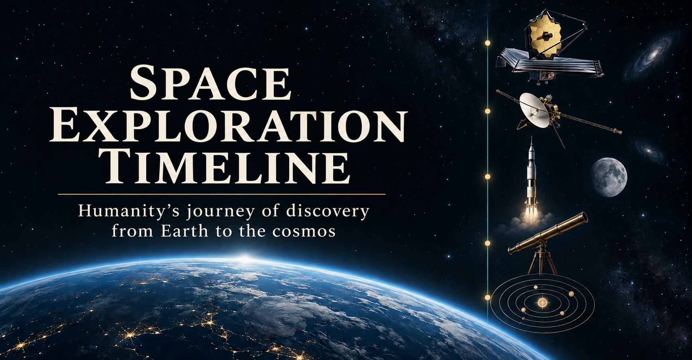

# Space Exploration Timeline

A bottom-to-top, trilingual visual history of humanity's study, discovery, and exploration of space. Start with ancient astronomy at the bottom and scroll upward through the scientific revolution, the rocket age, lunar exploration, and recent missions.

[](https://jtech-co.github.io/space-exploration-timeline/)

[Live site](https://jtech-co.github.io/space-exploration-timeline/) · [한국어 README](README-KR.md)

## Experience

- Every event pairs a translated title and explanation with a related visual object and source links. Several events can share a year without losing their separate identities.
- Procedural Three.js exhibits include Voyager, Webb, Sputnik, spacecraft, and celestial bodies. Drag an active exhibit to rotate it; its buttons control zoom and reset the view. On touch screens, use two fingers to rotate and one finger to scroll. Arrow keys rotate a focused exhibit, `+` / `-` zoom, and `Home` resets its view. Static illustrations remain visible when WebGL is unavailable.
- The page opens at its earliest end. Era buttons and the year selector jump across the longer timeline; changing between English, Korean, and Japanese preserves the event being read.
- A changing atmosphere, stars, and Earth limb accompany the ascent. The altitude readout is an editorial metaphor for humanity's growing reach, not a literal altitude assigned to every discovery.
- Responsive layouts, keyboard-accessible controls, and reduced-motion preferences support a range of devices.

## Run and check

Use Node.js 22.12 or higher (the current Vite requirement).

```bash
npm install
npm run dev
npm run validate
npm run build
npm run preview
```

The application is fully static. No API keys, account, backend, or environment variables are required.

For the browser checks, install Playwright and its Chromium browser if they are not already available, start the production preview, and run:

```bash
npm install --save-dev playwright
npx playwright install chromium
npm run preview -- --port 4280
# In another terminal:
npm run test:e2e
```

`E2E_URL` can point the browser checks at another local server. The checks cover content counts, bottom-to-top reading, translations and event positioning, navigation, mobile overflow, and exhibit interaction/fallbacks. `npm run validate` checks data shape and references; it does not independently prove the historical claims or the availability of external source pages.

## Project structure

```text
src/
  main.js             Page rendering, language and era navigation, scene state
  style.css           Responsive timeline and exhibit styling
  data/timeline.js    Event records and editorial update date
  i18n/ui.js          Interface translations and altitude layers
  visuals/observatory.js  Shared Three.js viewer and SVG illustrations
scripts/
  validate.mjs        Dependency-free data integrity checks
  e2e.mjs             Playwright browser checks
public/               Static assets
.github/workflows/    GitHub Pages deployment workflow
```

[`src/visuals/observatory.js`](src/visuals/observatory.js) renders the exhibits. The visual system retains a lightweight illustration for each event and shares one Three.js canvas between visible exhibits instead of creating a WebGL context for every historical row. It renders on demand and releases renderer and model resources when the viewer is disposed. Reduced motion removes inertial camera movement. The mouse wheel continues to scroll the timeline over an exhibit.

## Editing and sourcing

Event-specific exhibits are mapped by stable event IDs in `src/data/exhibits.js`. The 72 curated scenes cover 81 events, with translated captions explaining their interpretation and limits. `src/visuals/study-scenes.js` describes their geometry; `study-renderer.js` uses that same geometry for Three.js and SVG fallbacks. Related events may retain the same real spacecraft, while different concepts and hardware receive different geometry. Copernicus retains the solar system; Kepler uses one star and two example planets, focus-centred elliptical orbits, equal-time area sectors, and a time slider that also works without WebGL.

Run `npm run test:exhibits` for registry, geometry, and Kepler physics checks. With a local preview running, `npm run test:exhibits:browser` checks every distinct model, slider interaction, keyboard input, mobile layout, and WebGL fallback. Set `E2E_URL` to the preview URL (this suite defaults to port 4281).

Each record in [`src/data/timeline.js`](src/data/timeline.js) contains a stable `id`, historical `year` (negative for BCE), `title` and `body` in `en` / `ko` / `ja`, a `category`, a supported `visual`, and `sources` with descriptive labels and HTTPS URLs. Exact `date` and translated `detail` fields are optional. Keep IDs stable when correcting text so navigation and language switching can retain the same event.

The continuous annual ruler starts at `TICK_START`; earlier records appear individually. Multiple events may occupy the same year. `UPDATED_AT` records the editorial cutoff (2026-10-04), rather than promising that the site is live news.

Source links favor mission agencies, observatories, scientific institutions, and original publications where available. Recent additions and changed claims should be checked against sources that distinguish launch, encounter, observation, and announcement dates. Existing historical records were retained and enriched; this update does not claim that every inherited statement received a new independent fact check. Some broad overview links provide background rather than direct evidence for every detail in a record. Treat disputed priority claims and approximate ancient dates accordingly.

The procedural exhibits are educational reconstructions. They depict recognizable instruments and major components, but are not flight engineering meshes, surveyed terrain, exact scale models, or navigational ephemerides. A single exhibit can illustrate related events without representing their exact configuration or observation geometry.

## Deployment and license

Vite builds to `dist/`. The existing GitHub Actions workflow publishes pushes to `main` to GitHub Pages; `base: './'` supports a project subpath. Running local checks or building the project does not publish a deployment.

MIT license · [JTech-CO on GitHub](https://github.com/JTech-CO)
